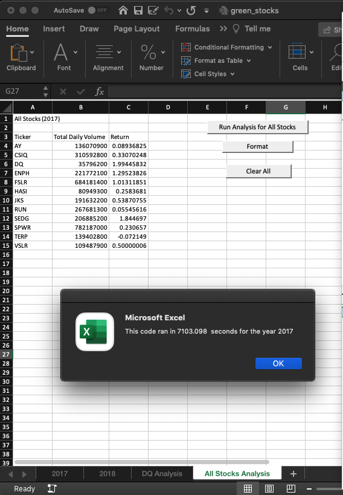
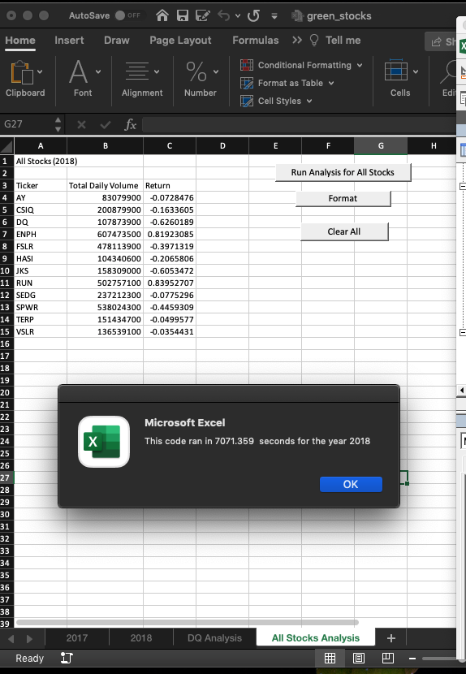
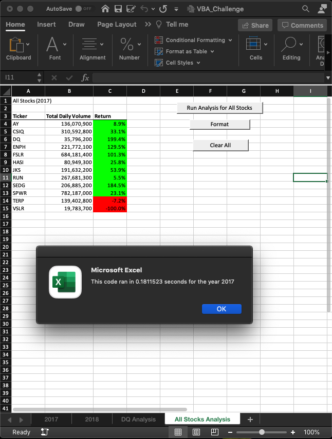
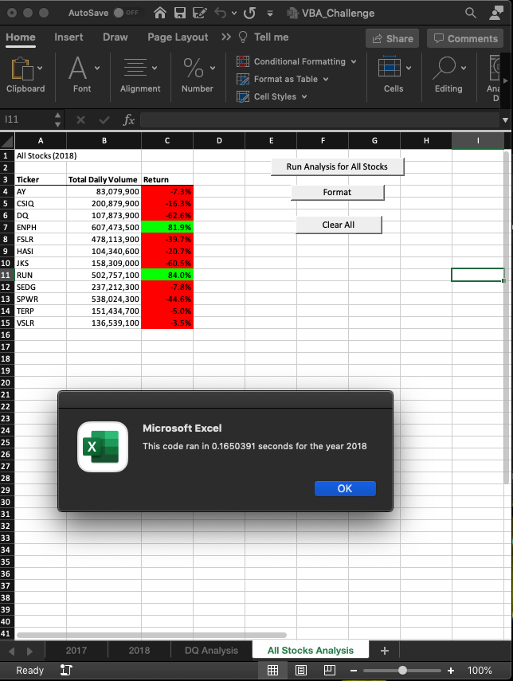

# stock-analysis

## Overview of Project:
The purpose of this analysis was to refactor the VBA code that collects information on stock market data for years 2017 and 2018. Code has already been created, but it is not an efficient process due to the amount of data collected on the stocks, so this challenge is being done to produce a more efficent and quicker process of getting through the data. By refactoring the code, our code can end up taking fewer steps, using less memory, or even lead to improved logic in its processing. It often lead to quicker processing and even cleaner code for reading and following. 

Refactoring is a common process, and here on this project, we attempt the refactoring on a new workbook to lead to a quicker process. This will be demonstrated through the use of a timer and comparing our original code with our new refactored code to show the improvement of efficiency in our code's process.

## Results
### Original Code

The timer was run on the original VBA code and the following time was given for processing:

It can be seen that in the original VBA coding, it takes 7103.10 seconds and 7071.36 seconds for code processing for years 2017 and 2018, respectively. The VBA codes are written to consider all 12 tickers within the given file. Those tickers are listed as their own array and are individually considered within the code process. This takes time to consider each and every ticker against the array. 

To improve the length of time to process the VBA code so that it will be capable of handling a high number and volume of tickers, instead of processing the code against every ticker, we have refactored the code to loop through rows and process itself against the row above and below it, this way, it efficiently can decipher the different tickers from each row vs being highly dependent on processing each ticker of each row against the array against potentially hundreds, if not thousands, of stock tickers.

Above, we have already provided the timing results of the original VBA code. The following photos contain the new timing of the refactored VBA code:

It can be seen from these photos that with the refactoring, the timing of code processing has significantly decreased:
  * 2017's VBA code changed from 7103.10 seconds to .1811 seconds
  * 2018's VBA code changed from 7071.36 seconds to .1650 seconds

## Conclusion
To conclude this analysis, let's ask and then answer the following questions:

  1. What are the advantages or disadvantages of refactoring code?

The advantages of refactoring any code, is that it can allow code to work efficiently/quickly. This is advantageous when there is a lot of data to be processed from excel through the VBA code. It can be the difference between a click of a button and an instant result, or a click of the button and wait time of a few seconds.  Oher advantages include a cleaner code for both the coder and someone else reading the code to understand what the code is doing, as well as being able to test the code as you proceed with the refactoring process, and that there is always room for steady improvement.

Some disadvantages to refactoring code is that one can get lost in the refactoring process if not testing as you go, and not maintaining clean/organized code. Another disadvantage is to ensure that you do not include any new code within the refactoring process. Refactoring is for existing purposes only, and not for new coding tasks. 

  2. How do these pros and cons apply to refactoring the original VBA script?

The pros and cons of what as been mentioned in comparison to the original VBA script are quite significant. While refactoring this code, it did become quite the task ensuring that indentations were correct and made sense within the code. VBA assist in errors, but not to the extent of other codeing languages that are more specific to what needs correcting in the code. Because of this, it is imperative to ensure that the code in VBA is clean and organized, or you can get lost in your work and lose the purpose of the code.

Another con is that you do need to approach refactoring with a plan in order to understand how to proceed in the refactoring process. Without a clear idea of what is being accomplished, the refactoring process becomes more difficult.

The greatest pro in refactoring, especially from the original VBA script, is that several pieces can be copied from the original script and be edited for refactoring without starting over from scratch. Another is that for every small piece of refactoring done, which is the best approach, you can test the code to ensure it works before proceeding. These two pros speed up the VBA coding process and helps tremendously in keeping the code organized, clean, and functioning as the refactoring process is being completed. 
